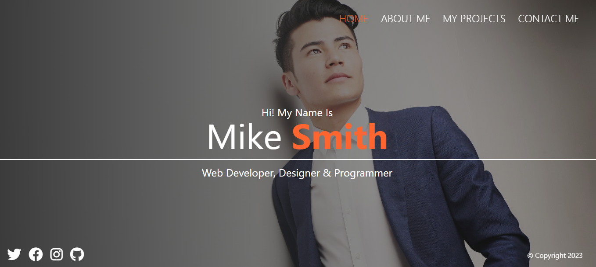

# Landing Page using SASS
Full tutorial via <a href="https://youtu.be/_a5j7KoflTs">codeStackr on Freecodecamp</a>

## <a href="https://daryldelrosario.github.io/fcc-sass-porfolio">Live Demo</a>
<kbd></kbd>

## Features
- Made using SASS
- Mobile-first design
- Three breakpoints: 768px 1024px 1200px

